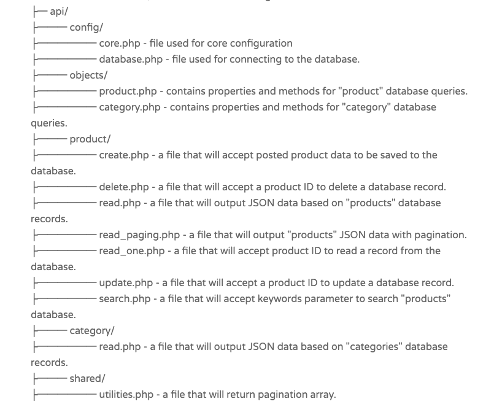

# REST-API-PHP
* A project to practice how to Create A Simple REST API in PHP.

## Features/Learning Objectives
* Set-up a local PHP server with [XAMPP](https://www.apachefriends.org/download.html) to run scripts and create MySQL DB.
* Create REST API endpoints that can be consumed by other applications (Android App, iOS, Desktop etc)
* Use [POSTMAN](https://www.postman.com/downloads/) to test API's.

## File Structure
 

## How to run
* Get a local php server up and running
* Import api_db.sql database with phpmyadmin, without it api's won't work 
* Install Postman to test api's
* All Endpoint Url's will look something like these, depending on folder structure
    * http://localhost/api_test/api/product/read.php
    * http://localhost/api_test/api/product/read_one.php 
    * http://localhost/api/product/search.php?s=shirt 
    * http://localhost/api_test/api/product/create.php 
    * http://localhost/api/product/update.php 
    * http://localhost/api_test/api/product/delete.php
* Use [POSTMAN](https://www.postman.com/downloads/) to test the api's : sample raw JSON to create an entry (POST)
> {
    "name" : "Amazing Pillow 2.0",
    "price" : "199",
    "description" : "The best pillow for amazing programmers.",
    "category_id" : 2,
    "created" : "2018-06-01 00:35:07"
}

